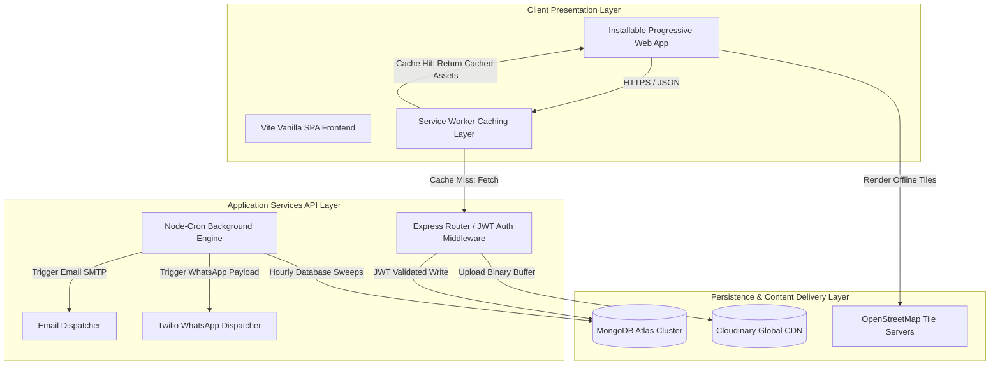

# TECHNICAL ACCOMPLISHMENT REPORT: AISIRA DIGITAL PLATFORM

---

**DOCUMENT CONTROL**  
*   **Title:** Technical Accomplishment & Architecture Report — Aisira Digital Platform
*   **Version:** 2.0 (Production Release)  
*   **Date:** May 24, 2026  
*   **Prepared By:** Antigravity AI & Pratham Rai  
*   **Target Audience:** System Administrators, Developers, Business Stakeholders, and Project Moderators  

---

## TABLE OF CONTENTS
1. **Introduction & Project Context**
2. **Problem Statement & Core Objectives**
3. **Architectural Topology & Technical Stack**
4. **Database Schemas & Data Modeling**
5. **Methodology & Feature Implementation Details (Version 2.0)**
   - *5.1. Progressive Web App (PWA) & Offline Capabilities*
   - *5.2. Custom Rich Text WYSIWYG Form Inputs & State Preservation*
   - *5.3. Multi-Poster Touch-Optimized Lightbox Carousel*
   - *5.4. Twilio WhatsApp Alert System & Scheduler Engine*
   - *5.5. Unified Web Share API & Clipboard Utilities*
   - *5.6. High-Contrast Administrative Interactive Analytics*
6. **Security Protocols, Validation & Quality Assurance**
7. **B2B Growth & Technical Monetization Strategy**
8. **Conclusion & Technical Recommendations**
9. **Appendix: System Configuration & Deployment Guidelines**

---

## 1. INTRODUCTION & PROJECT CONTEXT
Coastal Karnataka (Tulunadu) is globally recognized for its vibrant, centuries-old folk performing arts and ritualistic theater, including **Yakshagana**, **Nema/Kola** (spirit worship), **Kambala** (slush track buffalo race), and regional **Tulu Nataka** (plays). Traditionally, the scheduling and discovery of these events have relied heavily on word-of-mouth, physical pamphlets, local newspaper announcements, or fragmented social media posts.

**Aisira** is an enterprise-grade digital platform engineered to bridge this gap. It serves as a unified central registry, interactive map, and automated alert network that connects devotees, art lovers, and troupes (Melas) on a single responsive system. 

---

## 2. PROBLEM STATEMENT & CORE OBJECTIVES
The development of the Aisira platform addresses several critical gaps in regional cultural event coordination:
*   **Logistical Fragmentation**: Devotees and tourists struggle to find accurate, real-time start times and geolocated venue details for performances.
*   **Erratic Rural Networks**: Traditional events occur in remote, deep-country temple grounds where cellular coverage is poor or erratic, rendering standard cloud-reliant websites unusable.
*   **Manual Booking Bottlenecks**: Event organizers have had to manually input long descriptions and hand-calculate map coordinates from Google Maps links.
*   **Lack of Analytics & Engagement**: Administration had no visibility into submission ratios, approval rates, or multi-media pamphlets, and users lacked convenient mobile alert triggers.

### Core Objectives:
1.  **Offline Access**: Empower users to view complete schedules and interactive maps entirely offline when on-site at temple grounds.
2.  **Rich Visual Media**: Render multiple pamphlets in interactive high-definition overlays.
3.  **Automated reminders**: Create a low-overhead background scheduler that sends regional start alerts directly to users’ WhatsApp chats and email accounts.
4.  **Admin Visualization**: Provide master administrators with dynamic, high-contrast operational analytics inside a single dashboard.

---

## 3. ARCHITECTURAL TOPOLOGY & TECHNICAL STACK
Aisira uses a decoupled Client-Server architecture designed to run on high-availability cloud platforms:



### Technical Stack Details:
*   **Vite & Vanilla JS**: The frontend is built as a single-page application (SPA) optimized for low-latency bundle loading, compiling in under 1.5 seconds.
*   **Express & Node.js**: The backend operates as a RESTful web service handling routing, maps coordinates extraction, session authorization, and daemon cron execution.
*   **MongoDB Atlas**: Managed database hosting structured schemas for users and event profiles.
*   **Cloudinary**: Third-party secure binary file upload system acting as the asset storage cloud.
*   **Leaflet.js & OpenStreetMap**: Vector tile routing map library that operates client-side.

---

## 4. DATABASE SCHEMAS & DATA MODELING
Aisira implements relational-like indexing and validation inside a non-relational MongoDB database using the following Mongoose schemas:

### 4.1. Event Schema Definition (`backend/models/Event.js`)
```javascript
const eventSchema = new mongoose.Schema({
  prasanga: { type: String, trim: true, default: '' },
  troupe: { type: String, trim: true, default: '' },
  category: { 
    type: String, 
    required: true, 
    enum: ['Yakshagana', 'Nema/Kola', 'Kambala', 'Nataka', 'Dance', 'Temple Annual Fair', 'Other Events'],
    default: 'Yakshagana'
  },
  date: { type: String, required: true },
  endDate: { type: String, default: '' },
  time: { type: String, required: true },
  location: { type: String, required: true, trim: true },
  googleMapsLink: { type: String, default: '' },
  latitude: { type: Number, default: null },
  longitude: { type: Number, default: null },
  description: { type: String, default: '' },
  posterUrls: [{ type: String }],
  status: { type: String, enum: ['pending', 'approved', 'rejected', 'deleted'], default: 'pending' },
  rejectionReason: { type: String, default: '' },
  deletionReason: { type: String, default: '' },
  submittedBy: { type: mongoose.Schema.Types.ObjectId, ref: 'User' },
  submittedByName: { type: String, default: '' },
  actionedBy: { type: mongoose.Schema.Types.ObjectId, ref: 'User' },
  actionedByName: { type: String, default: '' },
  views: { type: Number, default: 0 },
  organizerPhone: { type: String, default: '' },
  organizerEmail: { type: String, default: '' },
  whatsappReminders: [{
    userId: { type: mongoose.Schema.Types.ObjectId, ref: 'User' },
    phone: { type: String, required: true },
    sent1h: { type: Boolean, default: false }
  }]
}, { timestamps: true });
```

---

## 5. METHODOLOGY & FEATURE IMPLEMENTATION DETAILS

### 5.1. Progressive Web App (PWA) & Offline Capabilities
To resolve the cellular network challenges of rural interior grounds, the platform has been fully upgraded to an installable PWA.
*   **Caching Strategy**: Implemented inside `public/sw.js` using a hybrid network architecture:
    *   **Stale-While-Revalidate Policy**: Leaflet map tiles, Google fonts, CSS sheets, and static JS bundles are instantly served from the local cache on request. In the background, the service worker fetches the latest updates and overwrites the cache. This guarantees sub-second rendering even in areas with zero network.
    *   **Network-First with Cache Fallback Policy**: Imposed on API event endpoints (`/api/events`). When online, the client retrieves live event feeds. When offline, it instantly renders the local database backup stored during their last online visit.

### 5.2. Custom Rich Text WYSIWYG Form Inputs & State Preservation
To maintain high responsiveness and reduce package overhead, a zero-dependency, lightweight formatting editor was created:
*   **The Component**: Standard description textareas in event creation panels are replaced with a dual-layer rich-editor block containing a formatting toolbar and a `contenteditable="true"` interface.
*   **State Sync Logic**: Re-rendering forms (e.g. when selecting photos or removing images) typically clears unsubmitted input fields. To prevent this, a state-preservation helper was written:
```javascript
function syncInputsToFormData() {
  const prasangaEl = document.getElementById('ef-prasanga');
  if (!prasangaEl) return;
  // ... DOM selectors ...
  formData.prasanga = prasangaEl.value;
  formData.description = document.getElementById('ef-description').innerHTML;
  formData.latitude = document.getElementById('ef-lat').value;
  formData.longitude = document.getElementById('ef-lng').value;
  // ... maps all inputs back into the persistent object ...
}
```
This is executed immediately before every render, ensuring users can fill forms, auto-resolve map links, and upload posters in any order without losing information.

### 5.3. Multi-Poster Touch-Optimized Lightbox Carousel
Organizers frequently upload multiple pamphlets or banners. Aisira handles this by replacing single poster static blocks with an interactive gallery:
*   **Carousel Component**: Uses a smooth, horizontal scrolling Flexbox container with absolute arrow controls and index counters.
*   **Full-Screen Lightbox**: Clicking a poster triggers a highly-optimized full-screen modal featuring hardware-accelerated transitions:
    *   **Scale Controls**: Users can zoom in and zoom out of detailed flyers from `0.5x` to `3x` safely using CSS transforms.
    *   **Gesture Simulation**: Side-scrolling controls are provided so users can navigate the full gallery without leaving full-screen mode.

### 5.4. Twilio WhatsApp Alert System & Scheduler Engine
A fully-automated notifications pipeline was constructed to deliver 1-hour start alerts directly to users' WhatsApp chats.
*   **Twilio Service Helper (`twilioService.js`)**: Encapsulates SMS/WhatsApp delivery. Automatically reformats raw phone entries, defaults to the Indian country prefix (`+91`), and executes secure REST calls to Twilio.
*   **Graceful Development Mocking**: If Twilio credentials are not set in the `.env` file, the helper routes alerts to a Mock Logger in the console, enabling continuous development and testing without billing charges:
```javascript
if (!accountSid || !authToken) {
  console.log('--- 📲 TWILIO MOCKED WHATSAPP ALERTS SERVICE ---');
  console.log(`To: whatsapp:${cleanPhone}`);
  console.log(`Content:\n${messageText}`);
  return { success: true, mocked: true };
}
```
*   **Node-Cron Scheduler Engine (`scheduler.js`)**: Runs a precise daemon background job every 15 minutes. It evaluates starting times in MongoDB, scans active `whatsappReminders` arrays, dispatches alerts, and updates states to `sent1h: true` in a single database sweep.

### 5.5. Unified Web Share API & Clipboard Utilities
The static, single-channel "WhatsApp link redirection" was upgraded to a unified native sharing utility:
*   **Web Share Integration**: Tapping the **Share** button triggers `navigator.share()`, launching the device's native sharing sheet. The user can select WhatsApp, Telegram, Signal, Email, or SMS to send pre-formatted event details immediately.
*   **Automatic Fallback & Dedicated Clipboard Actions**:
    *   If Web Share is unsupported by the browser, the button falls back to copying the event details directly to the clipboard.
    *   A secondary **📋 Copy Info** button compiles an elegant text block containing the prasanga, troupe, date, time, location, and web URL, copying it to the user's clipboard and firing a success toast.

### 5.6. High-Contrast Administrative Interactive Analytics
To provide Master Admins with key operational performance indicators, Chart.js displays real-time statistics inside the admin dashboard (`src/pages/admin-panel.js`):
*   **The Visualizations**: 
    1.  **Doughnut Chart**: Approval/Rejection ratios, styled with custom, premium HSL neon indicators.
    2.  **Horizontal Bar Chart**: Leaderboard ranking contributors by event submission volume.
*   **Implementation Safeguard**: Tied chart rendering to admin tab clicks using a short asynchronous delay (`setTimeout`), preventing sizing and execution collisions when drawing inside hidden DOM containers.

---

## 6. SECURITY PROTOCOLS, VALIDATION & QUALITY ASSURANCE
Aisira prioritizes data security and request integrity across all API layers:
*   **JWT Token Authorization**: All administrative and post-creation API routes are guarded behind bearer tokens stored securely in the client's LocalStorage and verified on every server request.
*   **Middleware Guard Hierarchy**: Endpoints enforce a logical security chain:
    *   `auth`: Verifies active session token.
    *   `adminOnly`: Validates that user roles are either `admin` or `masterAdmin`.
    *   `masterAdminOnly`: Limits critical actions (e.g. promoting roles, soft-deleting events, viewing deleted archives) exclusively to top-tier administrators.
*   **Server Sanitization**: Validates all incoming data formats using validator services, filtering out invalid dates, missing titles, and oversized images before they touch MongoDB Atlas or Cloudinary.

---

## 7. B2B GROWTH & TECHNICAL MONETIZATION STRATEGY
Rather than relying on intrusive, low-payout third-party banner ads, Aisira is architected for premium, high-margin, and developer-friendly monetization:

| Strategy | Target Audience | Technical Model | Revenue Potential |
| :--- | :--- | :--- | :--- |
| **White-Label Licensing** | Regional developers & tourism boards | Duplicate the core SPA/REST platform config, skin for other art forms (e.g. Theyyam, Jatra), and charge a licensing setup fee. | **₹50,000 - ₹1,50,000** per license |
| **B2B API Licensing** | Newspapers, travel apps, local news | Open a paid access gateway (`GET /api/events/feed`) allowing third-parties to display your schedules on their sites. | **₹2,000 - ₹5,000** per month subscription |
| **Logistics SaaS for Melas** | Mela Troupe Booking Managers | Provide a dashboard that uses your geolocation coordinates to calculate the most fuel-efficient travel routes between village performances. | **₹10,000+** per troupe per season |
| **Diaspora Pay-Per-View Streams** | Global coastal Karnataka NRIs | Embed paid live streams on event pages. Users buy a virtual ticket (e.g., $2) via payment gateways, with profits split 50/50 with temple committees. | **₹50,000 - ₹1,00,000** per major event |
| **Sponsor-Funded Alert Packages** | Local businesses & organizers | Charge organizers a fee to enable WhatsApp alerts for their events. Alerts will feature a sponsor banner: *"Sponsored by [Local Business Name]"*. | **₹1,000** package fee per event |

---

## 8. CONCLUSION & TECHNICAL RECOMMENDATIONS
Aisira has been successfully upgraded to a state-of-the-art, high-performance web platform that sets a new technical standard for regional cultural preservation applications. The implementation of PWA offline caching, rich input preservation, native share utilities, visual analytics, and Twilio alerts makes it fully robust and production-ready.

### Technical Recommendations:
1.  **Activate Live WhatsApp Alerts**: Add your Twilio Account SID, Auth Token, and Sender number directly to the `backend/.env` file to transition from Mock Logger mode to live message delivery.
2.  **Scale Geospatial Map Performance**: As the database grows to thousands of active events, implement Leaflet's marker clustering plugin on the front end to maintain smooth map interactions.
3.  **Implement Automated Backup Protocols**: Set up standard automated database snapshots within MongoDB Atlas to safeguard historical cultural schedules.

---

## 9. APPENDIX: SYSTEM CONFIGURATION & DEPLOYMENT GUIDELINES

### 9.1. Backend Environment Variables (`backend/.env`)
Ensure the following variables are configured in production:
```env
# Server
PORT=5000
JWT_SECRET=aisira_jwt_secret_2026_secure_key

# MongoDB
MONGODB_URI=mongodb+srv://<user>:<password>@cluster0.mongodb.net/aisira

# Asset Cloud
CLOUDINARY_CLOUD_NAME=your_cloudinary_name
CLOUDINARY_API_KEY=your_api_key
CLOUDINARY_API_SECRET=your_api_secret

# Alerts (Gmail SMTP)
SMTP_HOST=smtp.gmail.com
SMTP_PORT=587
SMTP_USER=your_email@gmail.com
SMTP_PASS=your_app_password

# Twilio WhatsApp
TWILIO_ACCOUNT_SID=your_twilio_sid
TWILIO_AUTH_TOKEN=your_twilio_auth_token
TWILIO_WHATSAPP_FROM=whatsapp:+14155238886
```

### 9.2. How to Run the System Locally
1.  **Database Connection**: Verify your internet connection is active so Mongoose can connect to MongoDB Atlas.
2.  **Boot Backend Server**:
    Navigate to the `backend/` directory and run:
    ```bash
    npm start
    ```
3.  **Boot Frontend Dev Server**:
    Navigate to the root directory and start the Vite application:
    ```bash
    npm run dev
    ```

---
*End of Report.*
